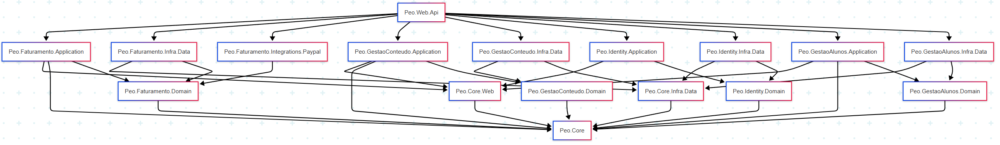

# Plataforma de Educação Online - Documentação

## Visão Geral
Esta documentação fornece um guia abrangente para a Plataforma de Educação Online, uma solução baseada em DDD para gerenciamento de conteúdo educacional.

## Índice
1. [Visão Geral da Arquitetura](./architecture.md)
2. [Bounded contexts (BCs)](./bounded-contexts.md)
4. [Estratégia de Testes](./testing.md)

## Stack Tecnológica
- .NET Core 9.0
- ASP.NET Core WebAPI
- Entity Framework Core
- SQL Server / SQLite
- Autenticação JWT
- Padrão CQRS
- Arquitetura DDD

## Estrutura do Projeto
```
src/
├── Peo.Web.Api/                 # Camada de API
├── Peo.GestaoConteudo/          # BC de Gestão de Conteúdo
├── Peo.GestaoAlunos/            # BC de Gestão de Alunos
├── Peo.Faturamento/             # BC de Faturamento
├── Peo.Identity/                # BC de Identidade
└── Peo.Core/                    # Core Compartilhado
```

## Gráfico de dependências


[Link para o gráfico - via MermaidChart](https://www.mermaidchart.com/play?utm_source=mermaid_live_editor&utm_medium=toggle#pako:eNqdlMFOwzAMhl-lyoHb-gAckKZVoN52QOJAUWXaDCJ1SdWmQhPi3XHXsGWxs3bstNjx_9uf3HyLytRS3ItdY76qT-hs8pwVOsHfVppyYzpZ5nrXQZmBhddCYDQdo-kxmo7RQrwlq9XDqcC7halA7EW--yp4DMvPBXkttVX2UGZmD0q7ur9oOkUXlJMBThLxIbyi5I7rhvFZt22jKrDKkF69FHFCBnMWT7K3YDZGWznU5pLHZW6WSiBF2ARyPCG2HzdEQC_qTGkF1suYjUf3l-0q9F83gzY9h3DKLAToZCL4nNQt68V0F_GMgXOm_8QWcX4EO3Swx70M1s5LzCLzRQgxX-gWYLQz3pDi8h1vprXUNsct_OiOwn25hUMLDTvw-VY63fLbuGaG3eFsyoniCWdRsWJvTGaOq2yZQfjvjXpE35rwvaOlzOPNrWvMk3yeE7dCi59fOMl0CA)

## Principais Funcionalidades
- Gestão de Cursos e Aulas
- Matrícula de Alunos
- Processamento de Pagamentos
- Acompanhamento do Progresso de Aprendizado
- Geração de Certificados
- Autenticação e Autorização de Usuários
